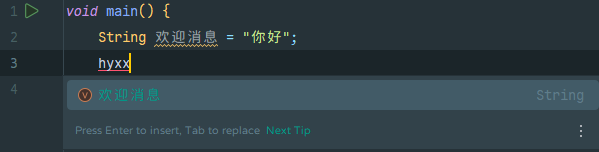

# 安装与使用 IntelliJ IDEA

虽然 JShell 适合测试片段，但要编写完整的程序，我们需要一款强大的 **IDE（集成开发环境）**。在 Java 领域，**IntelliJ IDEA** 是公认的最佳选择。

## 下载与安装

1. **访问官网**：前往 [JetBrains 官网](https://www.jetbrains.com/idea/download/)。
2. **版本说明**：
    * **IntelliJ IDEA 2025.3+**：从该版本起，JetBrains 对产品线进行了调整，不再提供传统的“社区版（Community Edition）”。
    * **订阅建议**：对于个人开发者和学生，可以申请免费的教育许可证，或使用带有基础功能的个人免费方案（具体参考官网最新政策）。
3. **安装说明**：
    * Windows 用户在安装时，建议勾选 **"Add 'bin' folder to the PATH"**，这样你可以在命令行直接用 `idea` 命令打开文件夹。

## 界面汉化 (可选)

如果你更习惯中文界面，可以切换界面语言：

* **Windows / Linux**：点击 **File（文件）** | **Settings（设置）** | **Appearance & Behavior（外观与行为）** | **System Settings（系统设置）** | **Language and Region（语言和区域）**。
* **macOS**：点击 **IntelliJ IDEA** | **Settings（设置）** | **Appearance & Behavior（外观与行为）** | **System Settings（系统设置）** | **Language and Region（语言和区域）**。

在 **Language（语言）** 下拉菜单中选择 **中文 (简体)**，重启 IDE 即可生效。

## 创建你的第一个 Java 25 项目

1. 点击 **New Project** (新建项目)。
2. **设置参数**：
    * **Name**: 项目名称（例如 `JavaLearning`）。
    * **JDK**: 确保选择你之前安装的 **JDK 25**。
3. **语言特性**：
    * 确保 **Language level** 设置为 `25`，以便使用最新的实验性或正式特性。
4. 点击 **Create**。

## 效率倍增：自动补全与拼音补全

### 快捷代码片段（Live Templates）

IDE 可以通过简写快速生成常用代码块。在 Java 25 的开发中，你可以尝试：

* **`iop` 补全**：输入 `iop` 然后按 `Tab`，IDE 会自动为你生成打印语句（`IO.println();`）。
* **`main` 补全**：快速生成主程序入口 `static void main() {}`。

### 拼音首字母补全（针对中文标识符）

IntelliJ IDEA 的一大“神技”是支持**拼音首字母补全**。如果你在代码中使用了中文命名的变量或方法（Java 是完全支持 Unicode 标识符的），你不需要切换输入法，直接输入拼音首字母即可补全。

**示例：**

1. 你定义了一个变量：`String 欢迎消息 = "你好";`
2. 当你下次想调用它时，只需输入 **`hyxx`**（“欢迎消息”的拼音首字母）。
3. IDE 的补全列表会精准弹出 `欢迎消息` 供你选择。

/// admonition
    type: note
这一特性极大地提升了在需要使用中文命名（如编写测试用例或特定领域业务代码）时的开发效率。
///

## 常用快捷键

* `Ctrl + Shift + F10`：直接运行当前程序。
* `Alt + Enter`：万能修复键（哪里报错点哪里）。
* `Ctrl + D`：快速复制当前行。

## 本节小结

本节，我们安装了 IntelliJ IDEA 并创建了第一个项目。我们还了解了 IDE 最重要的功能**自动补全**。同时，我们知道了 IntelliJ IDEA 支持拼音补全并学习了一些常用快捷键。
