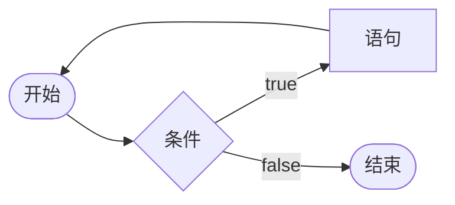
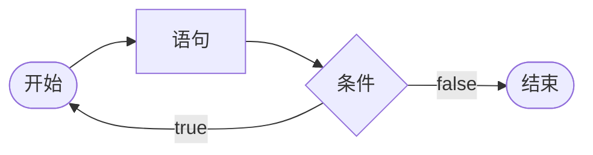
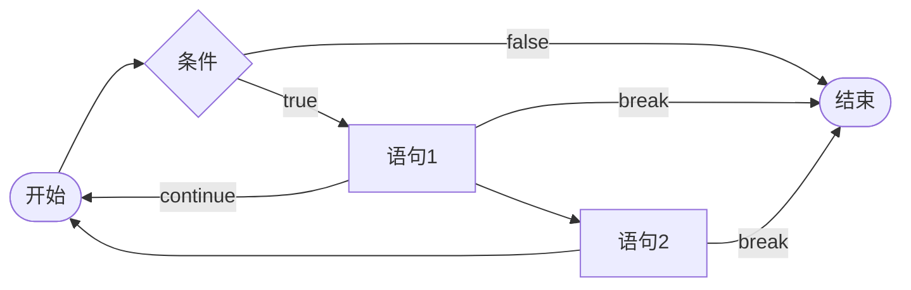

# 循环语句

循环语句能重复执行相同的语句。

## `while`语句

`#!java while`语句用于满足条件时重复执行语句，并在不满足条件时自动退出循环。

```java
while (条件) {
    语句;
    ...
}
```

以上代码，可以用流程图来表示：



## `do ... while`语句

`#!java do ... while`语句和`#!java while`类似，只是`#!java do ... while`语句先执行语句、后判断条件。

```java
void main() {
    int i = 2;
    do {
        i++;
    } while (i < 2);
    println(i); // 3

    int j = 2;
    while (j < 2) {
        j++;
    }
    println(j); // 2
}
```

用流程图表示：


## `for`语句

当`#!java while`语句满足以下形式

```java
T v = i;
while (c) {
    s;
    u;
}
```

时，我们可以用`#!java for`语句来表示：

```java
for (T v = i; c; u) {
    s;
}
```

也就是说，`#!java for`语句允许我们创建1个或几个临时变量作为计数器，并在满足条件`c`时执行语句`s`，最后执行更新语句`u`。其中，创建的临时变量只能在`#!java for`语句的循环体内使用。

`#!java for`语句圆括号内的三个语句都可能不存在。

一般地，条件`c`和更新语句`u`用于对临时变量操作，例如典型的重复执行`n`次的循环：

```java
for (int i = 0; i < n; i++) {
    语句;
    ...
}
```

## 死循环

当循环语句的条件始终为`true`时，该循环就是死循环。

对于`#!java for`语句，若条件`c`被省略，则相当于其条件始终为`true`。

```java
while (true) { }
for (;;) { }
```

死循环在处理不当的情况下会大量占用系统资源，因此循环语句应当在合适的情况下退出。下面我们来看退出、跳过循环的语句。

## 退出、跳过循环

`#!java break`语句负责退出循环。`#!java continue`语句负责跳过本次循环。

这两个语句都只能对离其最近的循环起作用。若要对外面的循环起作用，则需要使用标签来标记循环语句。

## 标签

标签（Label）可用于标记循环语句。

```java
void main() {
    标签名:
    for (int i = 0; i < 10; i++) {
        for (int j = 0; j < 10; j++) {
            println(i * 10 + j);
            if (j == 5) {
                continue 标签名;
            }
            if (i == 5) {
                break 标签名;
            }
        }
    }
}
```

/// admonition | 问题：以下代码能否编译？
    type: question
```text
void main() {
    https://squid233.github.io/java-tutorial/basic/control_flow/loop/
    for (int i = 0; i < 10; i++) {
        println(i);
    }
}
```
///

/// details | 答案
    type: tip
能。上面的代码刻意隐藏了高亮，实际上如果我们把代码高亮显示出来：
```java
void main() {
    https://squid233.github.io/java-tutorial/basic/control_flow/loop/
    for (int i = 0; i < 10; i++) {
        println(i);
    }
}
```
我们会发现标签名后那一部分代码比较暗，是因为`//`后面的内容是[注释](../source_file.md#注释)。
///

## 总结

一张图总结：


