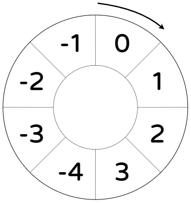

# 四则运算

Java 中的四则运算顺序和我们小学学过的一样，先乘除、后加减。在 Java 中，加减乘除分别用`+`、`-`、`*`（星号）、`/`（斜杠）表示。用圆括号（`()`）括起来使其最先运算。

## 整数

### 除零

试图将一个整数除以0会导致异常。

```
jshell> 0/0
|  异常错误 java.lang.ArithmeticException：/ by zero
|        at (#1:1)
```

### 溢出

JLS 规定，若整数相加、减或乘时超出了它的范围，即溢出。



如上图，设某类型的整数取值范围是$[-4, 3]$。当整数的值为3时，若对其加1，则整数溢出，值变为-4。

对于除法，只有某一数据类型的最小值除以-1时会溢出，其结果为被除数。

### 取整

两个整数相除，结果仍为整数。所得的结果向下取整，即去除小数部分。

## 浮点数

0除以0得`NaN`，正数除以0得`Infinity`，负数除以0得`-Infinity`。

在[浮点数](../datatype/floating_point.md)一节中我们知道 Java 中的浮点数遵守 IEEE 754 标准，这就带来了精度问题。作为初学者，我们只需要知道两个浮点数运算的结果不一定与预期相符就行了。

```
jshell> 0.1 + 0.2
$1 ==> 0.30000000000000004
```

## 取余

使用二元操作符`%`可对一个数取余数，格式为`被除数 % 除数`。结果的符号和被除数的符号相同。
