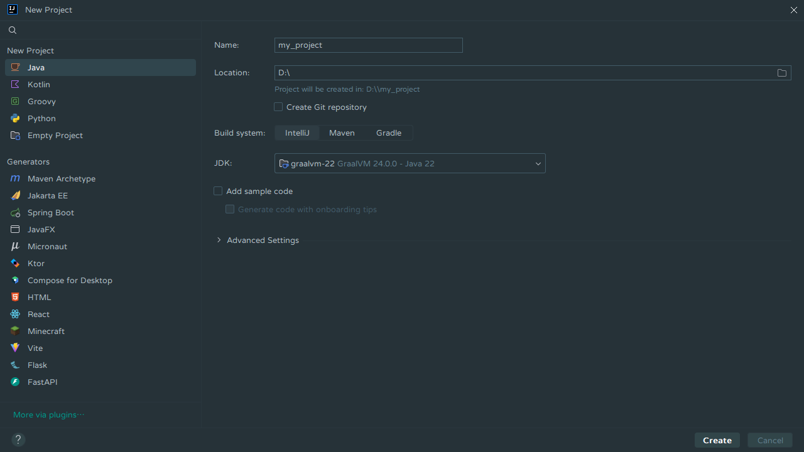
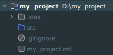
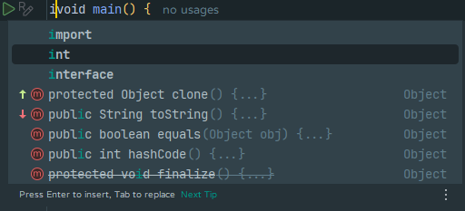
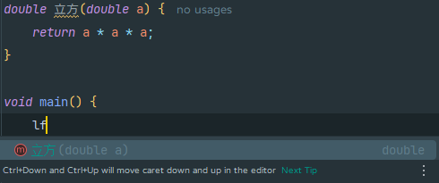

# IDE

在编写源文件前，我们需要下载 IDE。IDE（集成开发环境，Integrated development environment）集成了编辑、编译、运行等功能，能方便我们编程。

本书将使用由 JetBrains 开发的 IntelliJ IDEA。点击[这里](https://www.jetbrains.com/idea/download/)下载。我们只需要免费的社区版（Community Edition）即可。

安装完成后，我们就能启动 IDE 了。

<figure>

<figcaption>IntelliJ IDEA 启动界面</figcaption>
</figure>

<figure>

<figcaption>安装了插件的 IntelliJ IDEA 主界面</figcaption>
</figure>

在左方的“Plugins”处可搜索并下载中文语言包。

## 创建项目

点击主界面上方的`New Project`创建新项目。给项目取一个名字并设置 JDK。

## 项目结构

创建了项目后，我们会发现左方有多个文件。其中，`src`文件夹存放源码；`.gitignore`与 Java 关系不大；`.idea`文件夹和`my_project.iml`则是项目的配置文件。

## 设置预览功能

我们将在本书中使用预览功能。在右上角找到齿轮，打开`Project Structure`，设置`Language Level`为`22 (Preview)`。

## 自动补全

自动补全是 IDE 中最重要的功能。IntelliJ IDEA 支持自动补全，输入标识符中各单词（的首字母）会显示多个候选项。按`Enter`插入候选项，按`Tab`替换为候选项。

### 拼音补全

输入标识符中每个汉字的拼音的**首字母**也能自动补全。

