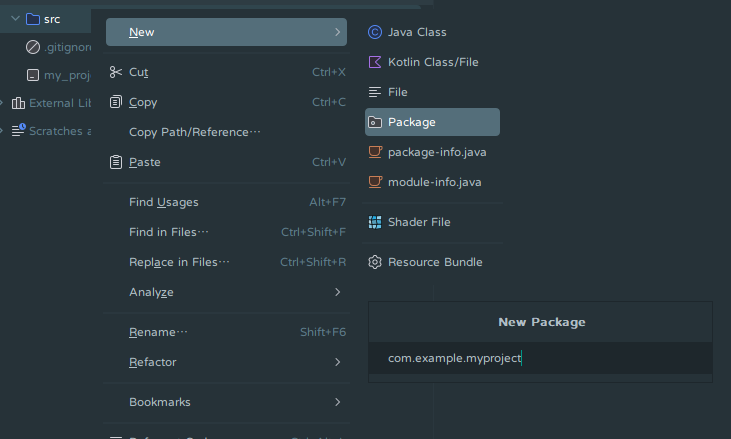

# 包

包（Package）用于组织 Java 类文件。在 Java 中，包的名称用点号分隔开，每个部分都对应一个文件夹。

我们一般将域名倒写作为包名。例如，作者的域名是`squid233.github.io`，包名就是`io.github.squid233`。我们还可以在其后面加上更多部分，以更好组织项目的结构。例如

- `io.github.squid233.myproject`是项目源代码的顶层包
- `io.github.squid233.myproject.api`存放公开的 API
- `io.github.squid233.myproject.internal`存放内部类
- `io.github.squid233.myproject.util`存放各种常用的工具类（Utilities）

*[API]: 应用程序编程接口，Application Programming Interface

我们在 IDE 中对`src`文件夹右击，选择`New->Package`，输入包名就能创建包了。

